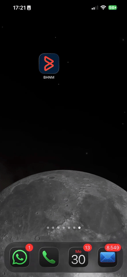
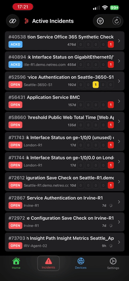
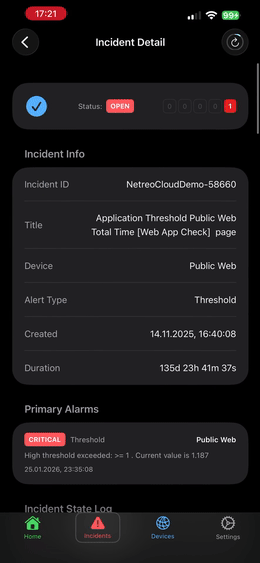
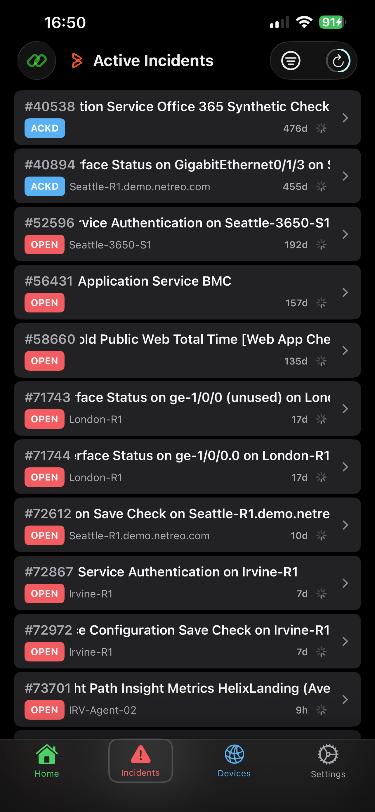

# BHNM - Mobile Client for BMC Network Management

An open source native iOS app for **BMC Helix Network Management** (BHNM). Monitor your infrastructure, manage incidents, and acknowledge alerts directly from your iPhone.

**When a new incident is created in BHNM, a push notification is instantly delivered to every registered iPhone** — no polling, no delay. Tap the notification to jump straight to the incident detail. This is a first-class feature of BeNeM, powered by a lightweight companion middleware ([bhnm-apns](https://github.com/ThomasStolt/bhnm-apns)) that bridges BHNM webhooks to Apple Push Notification service (APNs).

> **Note:** BMC Helix Network Management (BHNM) was formerly known as **Netreo**. Internal code identifiers (class names, AppStorage keys) still use the legacy `Netreo` prefix for backwards compatibility and will be migrated in a future release.

## Demo

Here are a few examples of how the app looks and feels like. You can see the home dashboard, active incidents, acknowledgement of incidents, device list and a device performance view.

<div align="center">
  
  &emsp;
  
  &emsp;
  
</div>

## Features

- **Push Notifications** — instant incident alerts delivered to all registered iPhones the moment a new incident is raised in BHNM; tap to navigate directly to the incident detail screen
- **Dashboard (Home)** — at-a-glance summary with active incident count, total device count, an animated incident ticker (open incidents only), and HOSTS / SERVICES / THRESHOLDS / ANOMALIES alarm summaries with drill-down links to Categories, Sites, and Business Workflows
- **Categories / Sites / Business Workflows** — group lists showing each group's device count and color-coded alarm status rows (H / S / T / A) across Green / Blue / Yellow / Orange / Red; alternating row backgrounds for readability; filter to show only groups with active alarms; empty group names shown as "Unknown"
- **Incident List** — live view of active, acknowledged, and closed incidents with severity badges and per-incident alarm counts; sorted newest-first by Incident ID
- **Acknowledge / Unacknowledge** — swipe right to ACK, swipe left to UnACK, with instant local status update
- **Incident Detail** — primary alarms, related alarms, and the full incident state log
- **Device Detail** — tap any device for a full detail view: active incidents, performance metric charts (CPU, memory, interfaces, latency), and network interface status
- **Performance charts on-demand** — metric cards in Device Detail fetch and render their time-series chart only when expanded
- **Incident Ticker** — animated banner on the Dashboard cycles through the latest open incidents; tap to navigate directly to the detail screen
- **Filters** — filter incidents by severity and status; filter tactical groups to show only those with any non-green alarms (hosts, services, thresholds, or anomalies)
- **Named connections** — save multiple BHNM servers and switch between them via a connection picker in Settings; connection test shows a green dot on success, no popup
- **QR code scanner** — scan a `benem://` configuration QR code directly from Settings to add a new server; generated by the [benem-admin](https://github.com/ThomasStolt/bhnm-apns) portal
- **URL scheme import** — import a server connection via `benem://configure?url=…&key=…` deep link (QR code, MDM profile, or share sheet)
- **Auto-refresh** — data refreshes automatically every 120 seconds with a visible countdown ring; tap the ring to refresh immediately
- **Auto-retry** — all screens automatically retry the connection 15 seconds after a network failure
- **Pull-to-refresh** — manual refresh at any time by pulling down any list
- **Discover BHNM Server** — scans your local Wi-Fi subnet for BHNM servers (Settings → Discover BHNM Server)
- **Connection Test** — built-in connectivity test with detailed diagnostics; green dot on success, red dot + alert on failure
- **Multiple API versions** — supports Legacy (PHP), API v1, API v2, and OpenAPI 3.0 endpoints

Here are two screenshots — the Dashboard with its alarm summary cards (left), and the Active Incidents dashboard with severity and alarm indicators (right):

<div align="center">
  
  &emsp;&emsp;&emsp;&emsp;&emsp;&emsp;
  
</div>

## Requirements

- iOS 16.0 or later
- Xcode 15 or later
- A running BHNM instance (on-premise or SaaS)

## Installation

### 1. Clone the repository

```bash
git clone https://github.com/thomasstolt/BeNeM.git
cd BeNeM
```

### 2. Open in Xcode

```bash
open BeNeM.xcodeproj
```

### 3. Configure signing

1. Select the `BeNeM` target in Xcode
2. Under **Signing & Capabilities**, select your Apple Developer Team
3. Adjust the Bundle Identifier if needed (default: `com.tstolt.benem`)

### 4. Build & Run

- **Simulator**: Select any iPhone simulator and press ▶
- **Physical device**: Connect your iPhone, select it as the destination and press ▶

Alternatively, use the included build script:

```bash
# Copy the example config and fill in your device UDID
cp build.local.sh.example build.local.sh
# Edit build.local.sh — set BENEM_DEVICE_ID to your device's UDID

# Build and deploy
./build_and_deploy.sh
```

> **Note:** For corporate or self-signed certificate servers the app includes `NSAllowsArbitraryLoads` in its `Info.plist`. Review and adjust your ATS settings before submitting to the App Store.

## Configuration

On first launch, open the **Settings** tab and enter:

| Field | Description |
|---|---|
| Base URL | Your BHNM server URL, e.g. `https://bhnm.example.com` |
| API Key | Your BHNM API key |
| PIN | Only required for SaaS deployments |
| ACK User | Username recorded when acknowledging incidents (defaults to `mobile`) |
| API Version | Choose the version that matches your BHNM deployment |
| Timeout | Request timeout in seconds (default: 30 s) |
| Retry Count | Number of retries on failure (default: 3) |

Tap the **Test** button to verify your settings. A green dot confirms the connection was successful and saves the server automatically; a red dot shows a diagnostic alert.

### Discover BHNM Server

If you are on the same Wi-Fi network as your BHNM server, tap **Settings → Discover BHNM Server** to automatically scan the local /24 subnet for BHNM instances. Discovered servers can be connected to directly from the results list.

## Project Structure

```
BeNeM/
├── Models/
│   ├── NetreoIncident.swift          # Incident data model
│   ├── IncidentDetail.swift          # Incident detail / alarm log model
│   ├── NetreoDevice.swift            # Device data model
│   └── GroupSummary.swift            # Aggregated alarm status per group
├── Services/
│   ├── NetreoAPIService.swift        # All API calls (incidents, devices, tactical, ACK)
│   ├── NetreoAPIConfiguration.swift  # URL building, endpoint routing
│   └── NetworkDiscovery.swift        # Local Wi-Fi subnet scan for BHNM servers
├── ViewModels/
│   ├── IncidentListViewModel.swift   # Filtering, sorting, alarm count loading
│   ├── DeviceListViewModel.swift     # Device list loading
│   ├── DeviceDetailViewModel.swift   # Concurrent incident + performance loading for one device
│   └── TacticalViewModel.swift       # Category / Site / Business Workflow loading
├── Views/
│   ├── SplashView.swift              # Animated launch screen with logo shimmer + version
│   ├── DashboardView.swift           # Home: status cards, incident ticker, alarm summaries
│   ├── GroupListView.swift           # Group list with alarm badges and device count
│   ├── IncidentListView.swift        # Incident list + swipe ACK/UnACK
│   ├── IncidentDetailView.swift      # Incident detail screen
│   ├── DeviceDetailView.swift        # Device detail: incidents, performance charts, interfaces
│   ├── AutoDiscoveryView.swift       # Wi-Fi server discovery UI
│   ├── AutoRefreshButton.swift       # Countdown ring + refresh button + connection badge
│   └── SettingsView.swift            # Configuration + named connections + version info
└── BeNeMApp.swift                    # App entry point + URL scheme handler
```

> **Note on class names:** Swift types use the legacy `Netreo` prefix (e.g. `NetreoAPIService`, `NetreoIncident`) as they predate the product rebrand. AppStorage keys (`netreo_base_url`, `netreo_api_key`, etc.) are also kept unchanged to preserve existing user settings.

## API Compatibility

The app uses a mix of BHNM's legacy PHP endpoints and RESTful endpoints:

| Action | Method | Endpoint |
|---|---|---|
| List incidents | POST | `/api/incident_api.php` (`method=getincidents`) |
| Incident detail | GET | `/api/incident_api.php` (`method=getincidentdetail`) |
| Acknowledge | POST | `/fw/index.php?r=restful/incident/acknowledge` |
| Unacknowledge | POST | `/fw/index.php?r=restful/incident/unacknowledge` |
| List devices | POST | `/fw/index.php?r=restful/devices/list` |
| Tactical overview (H/S/T) | POST | `/fw/index.php?r=restful/tactical-overview/data` |
| Find device by name | POST | `/fw/index.php?r=restful/devices/find` |
| Performance categories | POST | `/fw/index.php?r=restful/devices/performance-category` |
| Performance instances | POST | `/fw/index.php?r=restful/devices/performance-instance-per-category` |
| Time-series metrics | POST | `/fw/index.php?r=restful/devices/get-time-series-metrics` |

The tactical overview endpoint accepts a `grouping_type` body parameter (`category`, `site`, or `app` for Business Workflows) and returns pre-aggregated host, service, and threshold counts per group directly from BHNM's monitoring core — the same data source as BHNM's own web dashboard.

> **Note on alarm status:** H/S/T counts come directly from `restful/tactical-overview/data`, which returns `host_*_count`, `service_*_count`, and `threshold_*_count` fields per group. Status values map to badge colors as follows: `ok` → green, `ack` → blue, `warn` → yellow, `un` (unvalidated) → orange, `crit` → red.

## Push Notifications

BeNeM supports real-time push notifications for new incidents via a lightweight companion middleware ([bhnm-apns](https://github.com/ThomasStolt/bhnm-apns)) that bridges BHNM's webhook output to Apple Push Notification service (APNs).


When a new incident is raised in BHNM, a webhook fires to the middleware. The middleware authenticates the request, enriches the payload, and delivers it to the registered device via APNs. Tapping the notification navigates directly to the incident detail screen — even from a cold launch.

The middleware URL and shared secret are configurable in **Settings → Push Notifications** and can also be provisioned via the `benem://` deep-link URL scheme.

## Versioning

Releases follow [Semantic Versioning](https://semver.org): `MAJOR.MINOR.PATCH`.

```bash
# Bump version and build number (runs xcrun agvtool internally)
./scripts/bump_version.sh patch   # 1.1.0 → 1.1.1
./scripts/bump_version.sh minor   # 1.1.0 → 1.2.0
./scripts/bump_version.sh major   # 1.1.0 → 2.0.0
```

See [CHANGELOG.md](CHANGELOG.md) for the full release history.

## License

MIT — see [LICENSE](LICENSE) for details.
