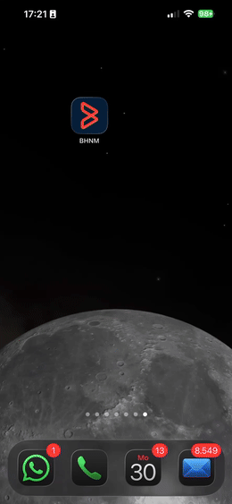
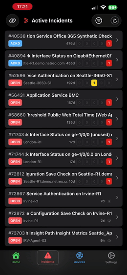
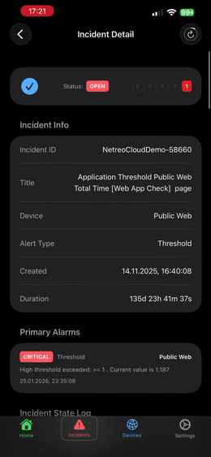
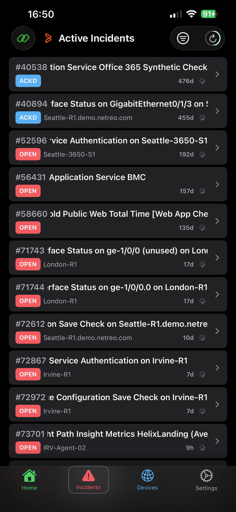

# BeNeM — incident alerts from BMC Helix Network Management, on your engineers' phones

**When BHNM raises an incident, every engineer's phone buzzes within seconds** — no polling, no
inbox, no dashboard to watch. Tap the alert and you are on the incident detail. When it clears,
they get told that too.

BeNeM is an open-source native iOS app and Android/desktop web app, plus a small self-hosted
service that bridges BHNM's webhooks to Apple Push Notification service and Web Push. You run it;
nothing about your monitoring leaves your infrastructure except the push itself.

## Demo

The iOS app: home dashboard, active incidents, acknowledging an incident, the device list and a
device performance view. The web app mirrors the same features with a browser-native UI.

<div align="center">
  
  &emsp;
  
  &emsp;
  
</div>

## Which of these are you?

| You are | Start here |
|---|---|
| **A BHNM administrator** who wants to roll this out to a team | This page, then [`docs/INSTALL.md`](docs/INSTALL.md). About an hour. |
| **An engineer** who was sent a QR code or a `benem://` link | Install the iOS app from the App Store, or open the web app your administrator gave you and add it to your home screen. Scan the code. That is all. |
| **A developer** who wants to build or change BeNeM | [`docs/DEVELOPING.md`](docs/DEVELOPING.md) |

## What it costs to run

| | |
|---|---|
| **A BHNM server** | version **26.1.02 or newer**, and permission to add a webhook action |
| **A small Linux VPS** | 1 vCPU / 1 GB RAM is plenty — around 5 €/month |
| **A domain name** | two hostnames pointing at that VPS |
| **Your time** | about an hour for the server |
| **Apple Developer Program** | 99 USD/year — **only if your users have iPhones**. Android and desktop need nothing from Apple. |

> **If you have iPhone users, read this before you start.** The App Store build cannot receive push
> notifications from *your* middleware: an APNs device token is bound to the Apple team that
> published the app. Self-hosted iOS push means building and distributing your own binary, under
> your own Bundle ID, via TestFlight or your own App Store listing. Android and desktop have no such
> constraint. Full explanation in [`docs/INSTALL.md`](docs/INSTALL.md) §0.

## Deploy it

The short path, for a VPS that can reach your BHNM server. If your BHNM is LAN-only, or the
middleware has to live on-premise, read [`docs/INSTALL.md`](docs/INSTALL.md) §2 first — the shape
changes.

**1. Point two hostnames at your VPS** and wait for them to resolve:

```bash
dig +short bhnm-apns.example.com     # both must return your server IP
dig +short benem.example.com         # before you continue — TLS depends on it
```

**2. Install Docker:**

```bash
curl -fsSL https://get.docker.com | sh
```

**3. Get the code:**

```bash
git clone https://github.com/ThomasStolt/BeNeM.git
cd BeNeM/middleware
cp .env.example .env
```

**4. Generate your secrets** — each command prints one value for `.env`:

```bash
openssl rand -hex 32     # BENEM_SECRET_KEY  — encrypts onboarding links
openssl rand -hex 32     # SESSION_SECRET    — signs admin sessions
openssl rand -hex 32     # PROXY_TOKEN       — app to middleware
openssl rand -hex 32     # WEBHOOK_SECRET    — BHNM to middleware
docker run --rm caddy:2.9-alpine caddy hash-password --plaintext 'your-password'   # BASIC_AUTH_HASH
docker run --rm python:3.11-alpine sh -c "pip -q install pyotp && python -c 'import pyotp; print(pyotp.random_base32())'"   # TOTP_SECRET
docker run --rm node:20-alpine npx -y web-push generate-vapid-keys                 # Android push
```

**5. If you need iOS push**, add your Apple keys — Team ID, an APNs `.p8` key created as
*Sandbox & Production*, its Key ID, and your Bundle ID. Step by step in
[`docs/INSTALL.md`](docs/INSTALL.md) §3.

**6. Tell it about your BHNM servers:**

```bash
cp servers.json.example servers.json     # id, name, url, api_key, pin
```

Set `BHNM_TLS_VERIFY=false` in `.env` if any of them uses a self-signed certificate — common
on-premise.

**7. Check before you start** — this catches most mistakes:

```bash
./check-env.sh
```

**8. Start it:**

```bash
docker compose up -d
curl https://bhnm-apns.example.com/health     # expect: status running
```

**9. Add the webhook in BHNM.** Create an action of type **`WebHook`**, 24x7, pointing at
`https://bhnm-apns.example.com/webhook?secret=YOUR_WEBHOOK_SECRET`, with the payload in
[`docs/INSTALL.md`](docs/INSTALL.md) §7.1 — then take one device down and back up and confirm you
get **both** a problem and a recovery alert.

**10. Onboard your users.** Open `https://bhnm-apns.example.com/admin/`, generate a QR code per
user, and send it. They scan it and are done — nobody types a URL or an API key.

Android and desktop users install the web app from `https://benem.example.com` — "Add to Home
screen". iPhone users install your build.

## What your engineers get

- **Instant incident alerts** — a push the moment BHNM raises an incident, and a "Resolved" push
  when it clears. Tap either to land on the incident detail, even from a cold start.
- **Acknowledge from the phone** — swipe to ACK or un-ACK; the list updates immediately.
- **A dashboard worth glancing at** — active incidents, device count, a ticker of the newest
  critical incidents, and HOSTS / SERVICES / THRESHOLDS / ANOMALIES summaries that drill down into
  Categories, Sites and Business Workflows.
- **Devices and their health** — searchable device list with per-device status badges, detail
  screens with active incidents, network interfaces, and performance charts (CPU per core, memory,
  disk, interfaces, latency) drawn on demand.
- **Maintenance windows** — set, see and end them from the phone; devices in maintenance are marked
  rather than hidden, so a real outage is never masked. *(Requires BHNM 26.3.01.)*
- **Several BHNM servers** — saved connections with a picker, each with its own alerts.
- **Zero-typing setup** — scan a QR code from the admin portal and the app is configured.
- **Refresh you can trust** — automatic every 120 s with a visible countdown, pull-to-refresh,
  automatic retry after a network failure, and a built-in connection test.

The full per-platform feature list lives in [`shared/feature-spec.md`](shared/feature-spec.md).

Here are two screenshots from the iOS app — the Dashboard with its alarm summary cards (left), and
the Active Incidents view (right):

<div align="center">
  
  &emsp;&emsp;&emsp;&emsp;&emsp;&emsp;
  
</div>

## How it fits together

```
BHNM incident → webhook → your middleware → APNs (iPhone) / Web Push (Android) → phone
```

One small service does the bridging. It also caches incident and device data so the apps load fast,
and proxies their API calls to BHNM — which means the apps never need a route to BHNM themselves,
only to your middleware.


Each BHNM server has its own webhook secret, and a device only receives alerts from the server it
registered against — so one middleware can serve several BHNM servers without crossing their alerts.

## Onboarding, in a bit more detail

The fastest way to get a user connected is for an administrator to send them a provisioning link generated by the **benem-admin** portal (part of [`middleware/`](middleware/)). The portal produces a `benem://configure?…` URL that carries the BHNM server URL, API key, optional PIN/LicenseID, and push middleware settings — all sensitive fields are AES-256-GCM encrypted inside the URL.

Administrators can share the link in two ways:

- **QR code** — the user opens the app's built-in scanner (**Settings → Scan QR Code**) and points the camera at the code. On iOS, the scanner is a full-screen camera view; on the Android PWA, it uses the browser's Barcode Detection API (or a WebRTC-based fallback for browsers that don't support it natively).
- **`benem://` deep link** — sent via email, chat, or MDM profile. Tapping the link on iOS opens the native app directly; on Android, tapping the link opens the installed PWA via its registered `web+benem` protocol handler (or, if not yet installed, the browser with a prompt to install first). Either platform then decrypts the payload, applies the settings, and is ready to use immediately.

This is the supported happy path — end users should never need to type a base URL or API key by hand.

## Keeping it running

```bash
cd ~/BeNeM/middleware && ./upgrade.sh          # rebuilds only what changed, health-checks after
docker compose up -d --force-recreate          # after editing .env — a restart is not enough
```

Back up `middleware/.env`, `middleware/servers.json` and your `AuthKey_*.p8` — Apple lets you
download that one only once.

**If something is broken**, nine times in ten it is one of these: the BHNM URL uses `http://`
against a TLS port (use `https://host:9443`); a self-signed certificate needs
`BHNM_TLS_VERIFY=false`; or you edited `.env` and only restarted instead of recreating.
[`docs/INSTALL.md`](docs/INSTALL.md) §13 has the rest.

## Documentation

| | |
|---|---|
| [`docs/INSTALL.md`](docs/INSTALL.md) | The full deployment guide — network topologies, Apple keys, every secret, the BHNM action, day-2 operations, known limitations, troubleshooting |
| [`docs/DEVELOPING.md`](docs/DEVELOPING.md) | Building and changing BeNeM — repository layout, project structure, API endpoints, versioning |
| [`middleware/README.md`](middleware/README.md) | Every environment variable and endpoint |
| [`shared/DECISION.md`](shared/DECISION.md) | Why native iOS plus a PWA, rather than one cross-platform app |
| [`shared/feature-spec.md`](shared/feature-spec.md) | The canonical feature list, per platform |
| [`shared/credentials-and-keys-overview.md`](shared/credentials-and-keys-overview.md) | Every secret in the system, where it lives, and the open security items |

## License and trademarks

MIT — see [LICENSE](LICENSE).

This is an independent open-source project. It is not affiliated with, endorsed, guaranteed or
supported by BMC Software. BMC, Helix and BHNM are trademarks of BMC Software, Inc. BMC Helix
Network Management was formerly known as **Netreo**; internal code identifiers still use the legacy
`Netreo` prefix for backwards compatibility.

Bug reports and feature requests are welcome.
